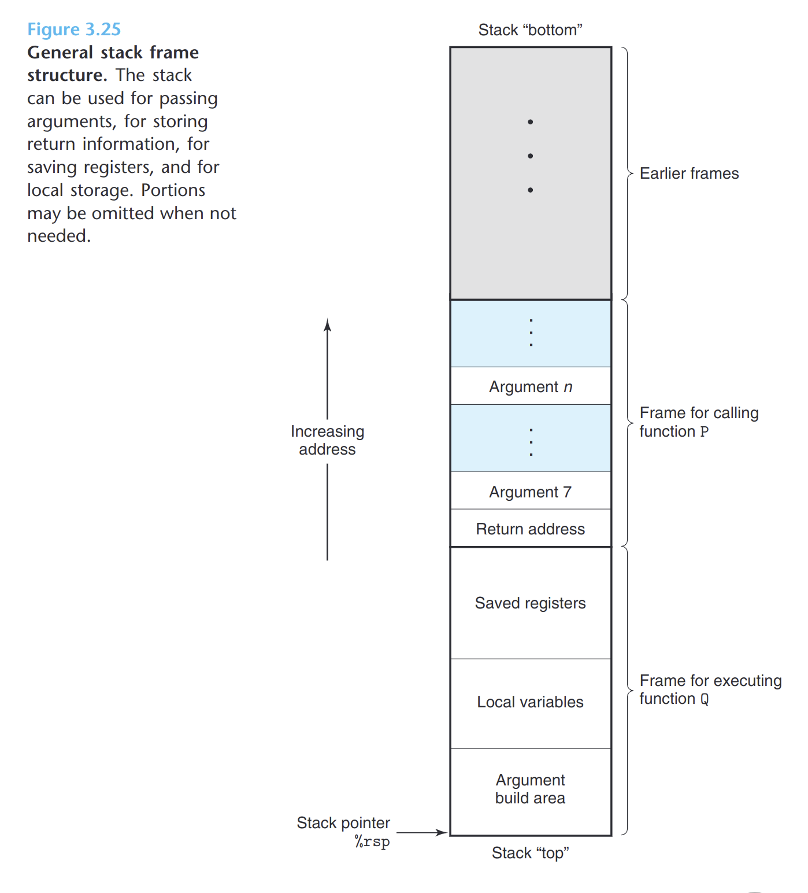

- C语言过程调用机制使用了栈数据结构提供的后进先出的内存管理原则。
- 程序用栈来管理它的过程所需的存储空间，栈和程序寄存器存放着传递控制和数据。
- **P调用Q:**
	- 当Q运行时，P以及所有向上追溯到P的过程都被暂时挂起。Q只需要为局部变量分配新的存储空间，或者设置到另一过程的调用。
	- 当Q返回时，任何它所分配的局部存储空间都可以被释放。
	- P调用Q，控制和数据信息添加到栈尾，返回时释放这些信息。
- 
- 当x86-64过程需要的存储空间超出寄存器能够存放的大小时，就会在栈上分配空间。这个部分称为过程的**栈帧**。
- 当P调用过程Q时，会把返回地址压入栈中，指明当Q返回时，要从P程序的那个位置继续执行。这个返回地址是P栈帧的一部分。
- Q的代码会扩展当前栈的边界，分配它的栈帧所需的空间。在这个空间中，它可以保存寄存器的值，分配局部变量空间，为它调用的过程设置参数。
- 大多数过程的栈帧都是定长的，在过程的开始就分配好了。
- 通过寄存器，过程P醉倒可以传递6个整数值(也就是指针和整数)，但如果Q需要更多的参数，P可以调用Q之前在自己的栈帧里存储这些参数。
- 许多函数都不需要栈帧，如果它的局部变量都可以包存在寄存器中，且该函数不会调用任何其他函数。