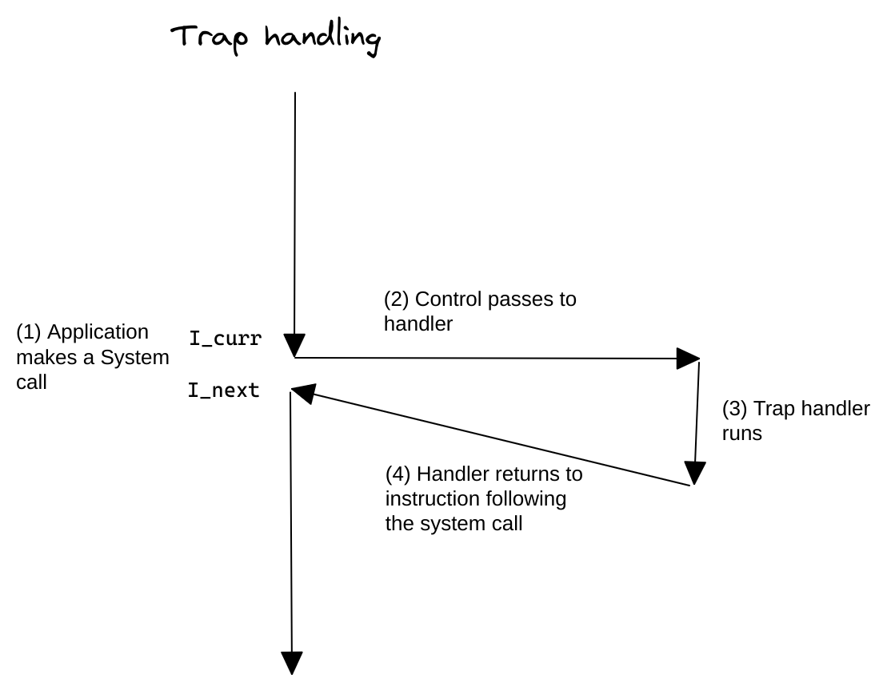

- ## 概念
	- 陷阱是有意的异常，是执行一条指令的结果。
	- 陷阱在用户程序和内核之间提供一个像过程一样的接口，[[系统调用]]
	- Executing the syscall instruction causes a trap to an exception handler that decodes the argument and call the appropriate kernel routine.
- ## 流程
	- 