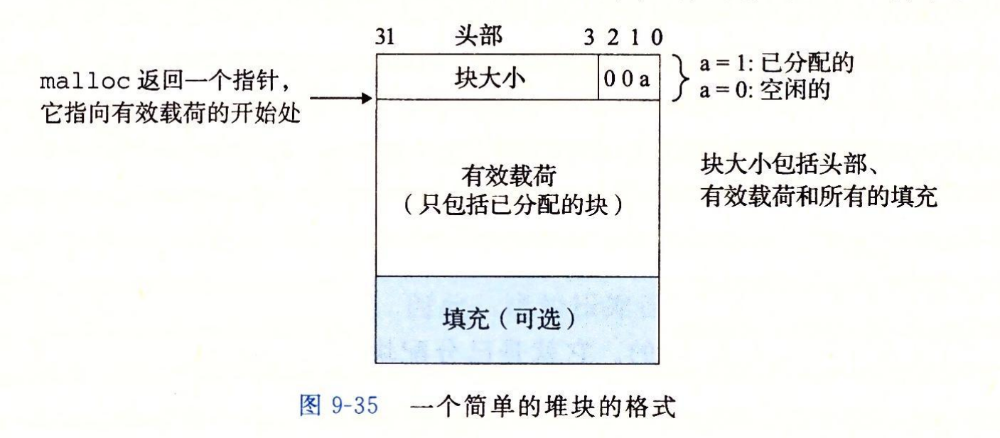
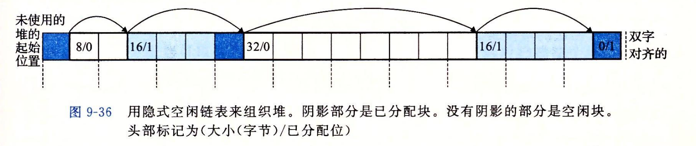
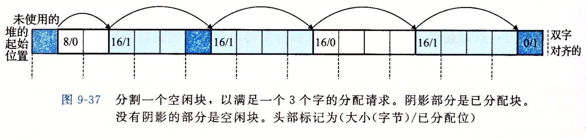
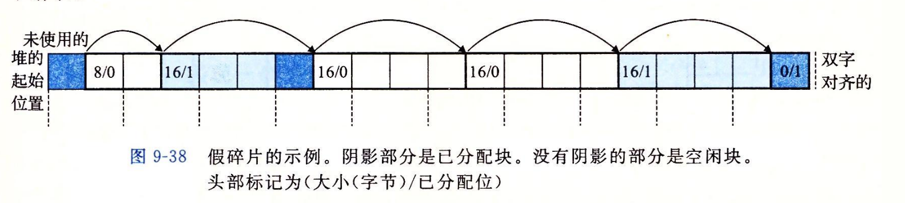
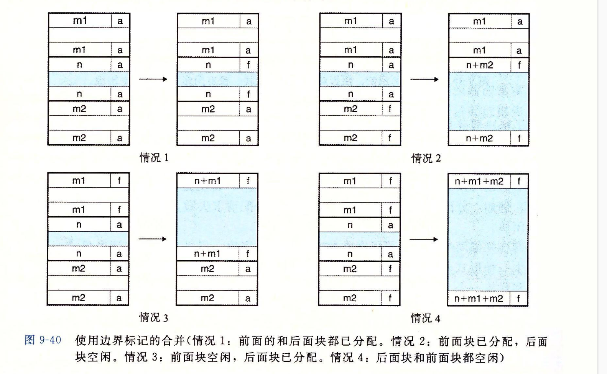

- ### 堆块
	- 任何实际的分配器都需要一些数据结构，允许它来区别边界，以及区别已分配块和空闲块。大多数分配器将这些信息嵌入块本身。如图:
		- 
		- 在这种情况下，一个块是由一个字的头部、有效载荷，以及一些额外的填充组成。头部编码了这个块的大小(包括头部和所有的填充)，以及这个块是已分配的还是空闲的。
			- 假设双字对齐，那么块的大小总是8的倍数，那么块大小的最低3位总是0。因此，描述块大小只需要29个高位，剩余的3位来编码其他信息。
				- 假设有一个已分配的块大小为24(0x18)字节，那它的头部是`0x00000018 | 0x1 = 0x00000019`
				- 假设有一个空闲块的大小为40(0x28)字节，那它的头部是`0x00000028 | 0x 0 = 0x00000028`
	- 头部后面是应用调用`malloc`时请求的有效载荷。有效载荷后面是一片不使用的填充块，其大小是任意的。填充原因可能是为了对付外部碎片或者为了满足对齐要求。
- ### 用隐式空闲列表组织堆
	- 
	- 空闲块通过头部中的大小字段隐含地连接着的。分配器可以通过遍历堆中所有的块，从而间接遍历整个空闲块的集合。
		- **注意**，我们需要某种特殊标记的结束块，示例中就是一个已设置了分配位而大小为0的终止头部(terminating header)(设置已分配位简化了空闲块的合并)
	- 使用隐式空闲列表的优点是简单，缺点是任何操作的开销。例如放置分配的块需要对空闲列表进行搜索，该搜索与已分配的块和空闲块的总数呈线性关系。
- ### 放置已分配的块
	- 当一个应用请求一个$k$字节的块时，分配器搜索空闲列表，查找一个足够大可以放置请求块的空闲块。分配器执行这种搜索的方式是由放置策略(placement policy)确定的。一些常见的策略是**首次适配**(first fit)、**下一次适配**(next fit)和**最佳适配**(best fit)。
	- #### 首次适配
		- 从头开始搜索空闲链表，选择一个合适的空闲块。
		- **优点**: 趋向于将大的空闲块保留在链表的后面。
		- **缺点**: 趋向于在靠近链表起始处留下小空闲块的碎片，增加了对较大块的搜索时间。
	- #### 下一次适配
		- 从上一次查询结束的地方开始搜索，选择一个合适的空闲块。
		- **优点**: 比首次适配更快，尤其是链表中的小碎片较多时。
		- **缺点**: 内存利用率比首次适配低的多。
	- #### 最佳适配
		- 检查每个空闲块，选择是个所需请求大小的最小空闲块。
		- **优点**: 内存利用率高。
		- **缺点**: 在简单的空闲列表组织结构中，使用最佳适配的缺点是它要求对堆进行彻底的搜索。
- ### 分割空闲块
	- 一旦一个分配器找到一个匹配的空闲块，它就必须做另一个决策，分配空闲块多少空间。可以使用整个空闲块，但会产生内部碎片。如果放置策略趋向于产生好的匹配，那么额外的内部碎片也是可以接受的。
	- 如果匹配不太好，分配器通常会选择将这个空闲块分割为两部分，分配块和新的空闲块。
	- 
- ### 获取额外的堆内存
	- 如果分配器不能为请求块找到合适的空闲块，有两个选择:
		- 1. 合并那些在内存中物理相邻的空闲块来创建一些更大的空闲块。
		- 2. 分配器通过调用`sbrk`函数，向内核请求额外的堆内存。分配器将额外的内存转化成一个大的空闲块，将这个块插入到空闲列表中，然后将被请求的块放置在这个新的空闲块中。
- ### 合并空闲块
	- **假碎片**: 当分配器释放一个已分配块时，可能有其他空闲块与这个新释放的空闲块相邻。这样邻接的空闲块在面临较大的分配请求时可能无法使用。
		- 
		- 图中的两个连续空闲块就无法满足有效载荷为四字的请求。
	- **合并**(coalescing)
		- **立即合并**(immediate coalescing): 每一次块被释放时，就合并所有的相邻块。
			- 立即合并简单明了，可以在常数时间内完成，但对于某些请求模式会产生抖动，块会被反复地合并，然后马上分割。例如上图中反复的分配和释放一个3个字的块就会产生大量不必要的分割和合并。
		- **推迟合并**(deferred coalescing): 等到某个稍晚的时候再合并空闲块。例如分配请求失败的时候。
- ### 带边界标记的合并
	- 合并当前块后面的块很容易，如果后面的块是空闲的，将它的大小加入到当前块的头部大小就行了。**那么如何合并前面的块呢？**
		- 假设有一个隐式空闲列表，合并它前面的空闲块只能从当前块往前搜索，将可以合并的块记录下来。这意味着每次调用`free`需要的时间与堆的大小呈线性关系。搜索时间不会是常数。
	- **边界标记**
		- 边界标记，在每一个块的结尾处添加一个脚部(footer)，其中脚部是头部的一个副本。如果每个块包含这样一个脚部，那么分配器就可以通过检查它的脚部，判断前面一个块的起始位置和状态，这个脚部总是距离当前块的开始位置一个字。
		- *使用边界标记的合并*
			- 
	- **优化边界标记**
		- **问题**: 如果应用程序需要操作很多小块，那么使用边界标记会产生显著的内存开销，如果每个分配请求都是两个内存字，那么头部和脚部就占用了内存开销的一半。
		- **解决办法**: 只有当前块是空闲时才需要它的脚部。如果把前面的块的`已分配/空闲位`存放在当前块多出来的低位中，那么已分配的块就不需要脚部了。不过空闲块仍然需要脚部。
-
	-